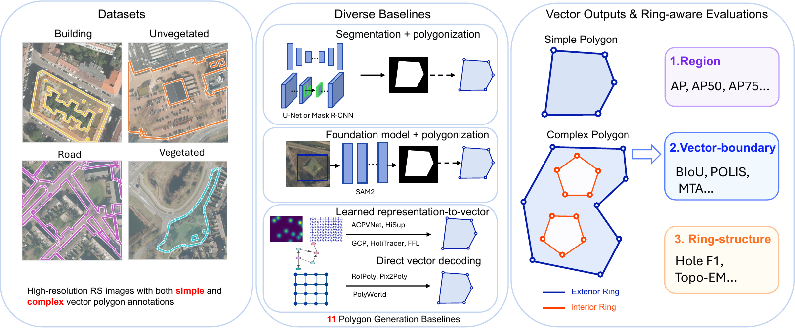

# PolyTopoBench: A Benchmark for Complex Vector Polygon Generation from Remote Sensing Imagery

[](https://neurips.cc/Conferences/2026)
[](https://huggingface.co/datasets/PingL/PolyTopoBench)

Zeping Liu, Ni Lao, Weiwei Sun, Gil Wolff, Yiqun Xie, Liang Zhao, Junfeng Jiao, Gengchen Mai

<p align="center"></p>

PolyTopoBench evaluates whether polygon generation models recover the full topology of vector polygons, including **interior rings (holes)**, rather than exterior boundaries only. It provides four single-class tasks on 512 × 512 aerial patches (Inria building; Deventer road, vegetation, unvegetated) with nearly 300K polygon instances and over 42K interior rings. It also provides 11 baselines under one runner and a unified evaluator that reports region (AP), vector-boundary (BIoU, POLIS, MTA) and ring-structure (Hole-F1, Topo-EM) metrics.

## Installation

```bash
git clone https://github.com/seai-lab/PolyTopoBench.git && cd PolyTopoBench
RESET_POLYTOPOBENCH_ENV=1 bash install_polytopobench_env.sh   # creates the conda env "polytopobench"
conda activate polytopobench
```

The installer builds Detectron2 and several CUDA extensions and needs a CUDA 12.x `nvcc`; see [ENVIRONMENT.md](ENVIRONMENT.md). The evaluator alone only needs `numpy`, `scipy`, `shapely` and `tqdm`.

## Data

Download the dataset from [Hugging Face](https://huggingface.co/datasets/PingL/PolyTopoBench) into `dataset/`:

```bash
hf download PingL/PolyTopoBench --repo-type dataset --local-dir dataset \
  --include "tasks.json" "inria/*" "deventer/*"                           # ~13 GB
hf download PingL/PolyTopoBench --repo-type dataset --local-dir dataset \
  --include "raw/inria/*"                                                 # optional, FFL on Inria only
```

Annotations are COCO-style JSON (plus GeoParquet) in which `segmentation = [exterior, hole_1, hole_2, ...]`; see the [dataset card](https://huggingface.co/datasets/PingL/PolyTopoBench) for details. To run the baselines, convert the release into each baseline's input format (about 15 minutes, 30 GB):

```bash
python prepare_data.py                          # all baselines except ACPV-Net
python prepare_data.py --methods hisup roipoly  # or only the ones you need
```

## Evaluate Your Method

Write your validation predictions as a JSON list, one record per polygon, with `image_id` taken from the task's `val.json`:

```json
[{"image_id": 1, "segmentation": [[x1, y1, x2, y2, ...], [hole ring], ...], "score": 0.93}]
```

Then score them with the unified evaluator:

```bash
python utilis/evaluate_vector_polygons.py --pred predictions.json --gt dataset/inria/building/val.json \
  --gt-type hisup --pred-type hisup --min-hole-area 16 --output metrics.json
```

Use `--pred-type roipoly` if your method outputs one record per ring; holes are then assigned by containment.

## Baselines

| Method | `--method` | Type | Ring mode | Original code |
|---|---|---|---|---|
| U-Net + Poly. | `unet_poly` | Seg. | Imp. | [smp](https://github.com/qubvel-org/segmentation_models.pytorch) |
| Mask R-CNN + Poly. | `maskrcnn_poly` | Seg. | Imp. | [torchvision](https://github.com/pytorch/vision) |
| SAM2 + Poly. | `sam2_poly` | FM | Imp. | [SAM 2](https://github.com/facebookresearch/sam2) |
| HiSup | `hisup` | Rep. | Imp. | [SarahwXU/HiSup](https://github.com/SarahwXU/HiSup) |
| ACPV-Net | `acpvnet` | Rep. | Exp. | [HeinzJiao/ACPV-Net](https://github.com/HeinzJiao/ACPV-Net) |
| FFL | `ffl` | Rep. | Exp. | [Lydorn/Polygonization-by-Frame-Field-Learning](https://github.com/Lydorn/Polygonization-by-Frame-Field-Learning) |
| GCP | `gcp` | Rep. | Exp. | [zhu-xlab/GCP](https://github.com/zhu-xlab/GCP) |
| HoliTracer | `holitracer` | Rep. | Imp. | [vvangfaye/HoliTracer](https://github.com/vvangfaye/HoliTracer) |
| Pix2Poly | `pix2poly` | Direct | Imp. | [yeshwanth95/Pix2Poly](https://github.com/yeshwanth95/Pix2Poly) |
| PolyWorld | `polyworld` | Direct | Imp. | [zorzi-s/PolyWorldPretrainedNetwork](https://github.com/zorzi-s/PolyWorldPretrainedNetwork) |
| RoIPoly | `roipoly` | Direct | Imp. | [HeinzJiao/RoIPoly](https://github.com/HeinzJiao/RoIPoly) |

*Seg.*: segmentation then polygonization; *FM*: foundation-model-assisted polygonization; *Rep.*: learned representation to vector; *Direct*: direct vector decoding. *Exp.*/*Imp.*: holes are modeled explicitly or implicitly.

Train and evaluate a baseline (datasets: `inria_building` with task `building`, `deventer_512_valtest_as_val` with tasks `road`, `vegetation` and `unvegetated`):

```bash
python main.py --method hisup --dataset inria_building --task building --mode train_eval
python main.py --method hisup --dataset deventer_512_valtest_as_val --task road --mode train_eval --smoke  # short run
python smoke_test.py --execute --method hisup   # few-step train + inference + evaluation check
```

Outputs go to `output/<method>/<dataset>/<task>/<run-name>/`, and `train_eval` ends with the unified evaluator's `metrics.json` (under `val_inference/` for FFL, GCP and HoliTracer, and under `eval_sparsercnn_val/` for RoIPoly). Override settings with `--set KEY=VALUE`; use `--dry-run` to print the commands without running them.

<details>
<summary>Baseline-specific notes</summary>

- **SAM2 + Poly.** prompts SAM2 with Mask R-CNN boxes, so run `maskrcnn_poly` first or pass `--bbox-json`.
- **ACPV-Net** needs the LDM kl-f4 autoencoder to encode its training targets (about 20 minutes and 33 GB on Inria):
  ```bash
  curl -L -o kl-f4.zip https://ommer-lab.com/files/latent-diffusion/kl-f4.zip
  unzip kl-f4.zip -d models/acpvnet/source/models/first_stage_models/kl-f4
  python prepare_data.py --methods acpvnet --encode-acpv-latents
  ```
- **RoIPoly** first trains its Sparse R-CNN proposal detector unless `--set DETECTOR_WEIGHTS=<path>` is given.
- **FFL** on Inria works on the full 5000 × 5000 tiles in `raw/inria/`; its predictions are mapped back to the 512 × 512 patches for evaluation.
- Pretrained weights for U-Net, Mask R-CNN and SAM2 are downloaded automatically on first use.

</details>

## Citation

```bibtex
@inproceedings{liu2026polytopobench,
  title     = {PolyTopoBench: A Benchmark for Complex Vector Polygon Generation from Remote Sensing Imagery},
  author    = {Liu, Zeping and Lao, Ni and Sun, Weiwei and Wolff, Gil and Xie, Yiqun and Zhao, Liang and Jiao, Junfeng and Mai, Gengchen},
  booktitle = {Advances in Neural Information Processing Systems (NeurIPS), Evaluations and Datasets Track},
  year      = {2026}
}
```

## Acknowledgements

The baselines under `models/*/source` are adapted from the repositories listed above and keep their original licenses. The data builds on the [Inria Aerial Image Labeling dataset](https://project.inria.fr/aerialimagelabeling/), [Deventer-512](https://huggingface.co/datasets/HeinzJiao/Deventer-512) and [OpenStreetMap](https://www.openstreetmap.org/copyright); see the [dataset card](https://huggingface.co/datasets/PingL/PolyTopoBench) for data licenses.
