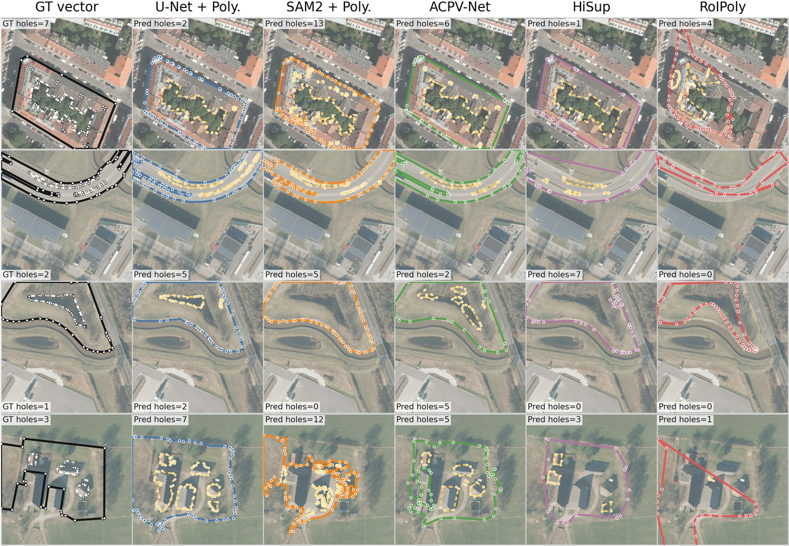

<div align="center">

<h1>PolyTopoBench: A Benchmark for Complex Vector Polygon Generation from Remote Sensing Imagery</h1>

Zeping Liu<sup>1</sup>, Ni Lao<sup>1</sup>, Weiwei Sun<sup>2</sup>, Gil Wolff<sup>2</sup>, Yiqun Xie<sup>3</sup>, Liang Zhao<sup>4</sup>, Junfeng Jiao<sup>1</sup>, Gengchen Mai<sup>1,&#9993;</sup>

<sup>1</sup>The University of Texas at Austin &nbsp; <sup>2</sup>Amazon &nbsp; <sup>3</sup>University of Maryland &nbsp; <sup>4</sup>Emory University

**NeurIPS 2026 (Evaluations and Datasets Track)**

[](#)
[](https://huggingface.co/datasets/PingL/PolyTopoBench)
[](ENVIRONMENT.md)

</div>

<p align="center"></p>

**TL;DR** Existing polygon benchmarks mostly score exterior boundaries. PolyTopoBench asks whether a model recovers the complete topology of a vector polygon, **including its interior rings (holes)**.

## ✨ Highlights

- **Four complex-polygon tasks.** Inria building and Deventer road, vegetation and unvegetated. The tasks contain nearly 300K polygon instances, more than 10K complex polygons and over 42K interior rings. The Inria vector ground truth is aligned from OpenStreetMap and manually corrected.
- **Ring-aware evaluation.** One evaluator reports region (AP), vector-boundary (BIoU, POLIS, MTA) and ring-structure (Hole-F1, Topo-EM) metrics, separately for exterior and interior rings.
- **Eleven baselines under one runner.** The baselines cover segmentation-based, foundation-model, representation-to-vector and direct decoding methods, all trained on the same splits and scored the same way.

## 📊 Dataset

| Task | Instances | Complex | Interior rings | Holes / complex | Avg. vertices |
|---|---:|---:|---:|---:|---:|
| Inria Building | 254,133 | 5,512 | 19,854 | 3.60 | 10.27 |
| Deventer Road | 4,533 | 1,066 | 9,992 | 9.37 | 62.57 |
| Deventer Vegetation | 23,517 | 859 | 1,477 | 1.72 | 11.98 |
| Deventer Unvegetated | 16,552 | 2,942 | 10,749 | 3.65 | 21.53 |

All tasks use 512 × 512 patches (Inria: 11,860 train / 3,500 val; Deventer: 1,716 train / 432 val). Annotations are COCO-style JSON and GeoParquet, where `segmentation = [exterior, hole_1, hole_2, ...]`. See the [dataset card](https://huggingface.co/datasets/PingL/PolyTopoBench) for the format and licenses.

## 🏆 Benchmark Results

Selected metrics from the main results table of the paper (higher is better; best per column in bold). The paper reports the full set of boundary metrics.

<table>
<tr><th rowspan="2">Type</th><th rowspan="2">Method</th><th colspan="3">Inria Building</th><th colspan="3">Deventer Road</th><th colspan="3">Deventer Vegetation</th><th colspan="3">Deventer Unvegetated</th></tr>
<tr><th>AP50</th><th>Hole-F1</th><th>Topo-EM</th><th>AP50</th><th>Hole-F1</th><th>Topo-EM</th><th>AP50</th><th>Hole-F1</th><th>Topo-EM</th><th>AP50</th><th>Hole-F1</th><th>Topo-EM</th></tr>
<tr><td rowspan="2">Seg.</td><td>U-Net + Poly.</td><td>0.670</td><td>0.514</td><td><b>0.531</b></td><td><b>0.520</b></td><td><b>0.466</b></td><td><b>0.144</b></td><td><b>0.382</b></td><td><b>0.022</b></td><td>0.222</td><td><b>0.247</b></td><td><b>0.428</b></td><td>0.088</td></tr>
<tr><td>Mask R-CNN + Poly.</td><td><b>0.720</b></td><td>0.167</td><td>0.519</td><td>0.113</td><td>0.010</td><td>0.081</td><td>0.357</td><td>0.017</td><td><b>0.273</b></td><td>0.181</td><td>0.254</td><td><b>0.099</b></td></tr>
<tr><td rowspan="1">FM</td><td>SAM2 + Poly.</td><td>0.431</td><td>0.017</td><td>0.377</td><td>0.023</td><td>0.014</td><td>0.012</td><td>0.079</td><td>0.003</td><td>0.099</td><td>0.005</td><td>0.009</td><td>0.020</td></tr>
<tr><td rowspan="5">Rep.</td><td>HiSup</td><td>0.496</td><td>0.473</td><td>0.387</td><td>0.389</td><td>0.303</td><td>0.137</td><td>0.264</td><td>0.016</td><td>0.181</td><td>0.110</td><td>0.350</td><td>0.044</td></tr>
<tr><td>ACPV-Net</td><td>0.575</td><td><b>0.527</b></td><td>0.440</td><td>0.361</td><td>0.394</td><td>0.137</td><td>0.274</td><td>0.006</td><td>0.154</td><td>0.082</td><td>0.265</td><td>0.026</td></tr>
<tr><td>FFL</td><td>0.400</td><td>0.000</td><td>0.222</td><td>0.163</td><td>0.000</td><td>0.027</td><td>0.254</td><td>0.000</td><td>0.132</td><td>0.011</td><td>0.000</td><td>0.002</td></tr>
<tr><td>GCP</td><td>0.631</td><td>0.015</td><td>0.065</td><td>0.281</td><td>0.015</td><td>0.004</td><td>0.203</td><td>0.001</td><td>0.024</td><td>0.068</td><td>0.009</td><td>0.008</td></tr>
<tr><td>HoliTracer</td><td>0.034</td><td>0.008</td><td>0.056</td><td>0.008</td><td>0.024</td><td>0.010</td><td>0.097</td><td>0.009</td><td>0.104</td><td>0.011</td><td>0.065</td><td>0.007</td></tr>
<tr><td rowspan="3">Direct</td><td>Pix2Poly</td><td>0.102</td><td>0.047</td><td>0.084</td><td>0.001</td><td>0.000</td><td>0.003</td><td>0.028</td><td>0.000</td><td>0.023</td><td>0.000</td><td>0.000</td><td>0.000</td></tr>
<tr><td>PolyWorld</td><td>0.016</td><td>0.002</td><td>0.021</td><td>0.000</td><td>0.000</td><td>0.000</td><td>0.004</td><td>0.000</td><td>0.004</td><td>0.000</td><td>0.000</td><td>0.000</td></tr>
<tr><td>RoIPoly</td><td>0.001</td><td>0.002</td><td>0.001</td><td>0.002</td><td>0.192</td><td>0.009</td><td>0.032</td><td>0.009</td><td>0.060</td><td>0.005</td><td>0.127</td><td>0.008</td></tr>
</table>

<p align="center"></p>

Predicted exterior rings usually follow the object, but interior rings are often missing or spurious.

## 🛠️ Installation

```bash
git clone https://github.com/seai-lab/PolyTopoBench.git && cd PolyTopoBench
RESET_POLYTOPOBENCH_ENV=1 bash install_polytopobench_env.sh   # creates the conda env "polytopobench"
conda activate polytopobench
```

The installer needs a CUDA 12.x `nvcc` to build Detectron2 and the CUDA extensions; see [ENVIRONMENT.md](ENVIRONMENT.md). The evaluator alone only needs `numpy`, `scipy`, `shapely` and `tqdm`.

## 📦 Data Preparation

```bash
hf download PingL/PolyTopoBench --repo-type dataset --local-dir dataset \
  --include "tasks.json" "inria/*" "deventer/*"          # benchmark data, ~13 GB
hf download PingL/PolyTopoBench --repo-type dataset --local-dir dataset \
  --include "raw/inria/*"                                # optional: full Inria tiles, for FFL only

python prepare_data.py                          # convert to each baseline's input format (~15 min, 30 GB)
python prepare_data.py --methods hisup roipoly  # or only the baselines you need
```

`prepare_data.py` is only needed for the baselines. To evaluate your own method, use `dataset/` directly.

## 🚀 Evaluate Your Method

Write validation predictions as a JSON list with one record per polygon. Use `image_id` from the task's `val.json`, and list the exterior ring first, followed by its holes:

```json
[{"image_id": 1, "segmentation": [[x1, y1, x2, y2, ...], [hole ring], ...], "score": 0.93}]
```

```bash
python utilis/evaluate_vector_polygons.py --pred predictions.json --gt dataset/inria/building/val.json \
  --gt-type hisup --pred-type hisup --min-hole-area 16 --output metrics.json
```

If your method outputs one record per ring, use `--pred-type roipoly`; holes are then assigned by containment.

## 🧪 Baselines

| Type | Method | `--method` | Ring mode | Original code |
|---|---|---|---|---|
| Seg. | U-Net + Poly. | `unet_poly` | Imp. | [segmentation_models.pytorch](https://github.com/qubvel-org/segmentation_models.pytorch) |
| Seg. | Mask R-CNN + Poly. | `maskrcnn_poly` | Imp. | [torchvision](https://github.com/pytorch/vision) |
| FM | SAM2 + Poly. | `sam2_poly` | Imp. | [facebookresearch/sam2](https://github.com/facebookresearch/sam2) |
| Rep. | HiSup | `hisup` | Imp. | [SarahwXU/HiSup](https://github.com/SarahwXU/HiSup) |
| Rep. | ACPV-Net | `acpvnet` | Exp. | [HeinzJiao/ACPV-Net](https://github.com/HeinzJiao/ACPV-Net) |
| Rep. | FFL | `ffl` | Exp. | [Lydorn/Polygonization-by-Frame-Field-Learning](https://github.com/Lydorn/Polygonization-by-Frame-Field-Learning) |
| Rep. | GCP | `gcp` | Exp. | [zhu-xlab/GCP](https://github.com/zhu-xlab/GCP) |
| Rep. | HoliTracer | `holitracer` | Imp. | [vvangfaye/HoliTracer](https://github.com/vvangfaye/HoliTracer) |
| Direct | Pix2Poly | `pix2poly` | Imp. | [yeshwanth95/Pix2Poly](https://github.com/yeshwanth95/Pix2Poly) |
| Direct | PolyWorld | `polyworld` | Imp. | [zorzi-s/PolyWorldPretrainedNetwork](https://github.com/zorzi-s/PolyWorldPretrainedNetwork) |
| Direct | RoIPoly | `roipoly` | Imp. | [HeinzJiao/RoIPoly](https://github.com/HeinzJiao/RoIPoly) |

*Seg.*: segmentation then polygonization. *FM*: foundation-model-assisted. *Rep.*: learned representation to vector. *Direct*: direct vector decoding. *Exp.* / *Imp.*: holes are modeled explicitly or implicitly.

```bash
python main.py --method hisup --dataset inria_building --task building --mode train_eval
python main.py --method hisup --dataset deventer_512_valtest_as_val --task road --mode train_eval --smoke  # short run
python smoke_test.py --execute --method hisup   # few-step train, inference and evaluation check
```

Deventer tasks are `road`, `vegetation` and `unvegetated`. Outputs go to `output/<method>/<dataset>/<task>/<run-name>/`, and `train_eval` finishes with the unified evaluator's `metrics.json`. Override settings with `--set KEY=VALUE`, and preview commands with `--dry-run`.

<details>
<summary>Baseline-specific notes</summary>

- **Metrics location.** `metrics.json` is written to `val_inference/` for FFL, GCP and HoliTracer, to `eval_sparsercnn_val/` for RoIPoly, and to the run folder for the other baselines.
- **SAM2 + Poly.** prompts SAM2 with Mask R-CNN boxes, so run `maskrcnn_poly` first or pass `--bbox-json`.
- **ACPV-Net** needs the LDM kl-f4 autoencoder to encode its training targets. Encoding takes about 20 minutes and 33 GB on Inria:
  ```bash
  curl -L -o kl-f4.zip https://ommer-lab.com/files/latent-diffusion/kl-f4.zip
  unzip kl-f4.zip -d models/acpvnet/source/models/first_stage_models/kl-f4
  python prepare_data.py --methods acpvnet --encode-acpv-latents
  ```
- **RoIPoly** first trains its Sparse R-CNN proposal detector, unless you pass `--set DETECTOR_WEIGHTS=<path>`.
- **FFL** on Inria trains on the full 5000 × 5000 tiles in `raw/inria/`. Its predictions are mapped back to the 512 × 512 patches before evaluation.
- **Pretrained weights** for U-Net, Mask R-CNN and SAM2 are downloaded automatically on first use.

</details>

## 📝 Citation

If you find PolyTopoBench useful, please cite:

```bibtex
@inproceedings{liu2026polytopobench,
  title     = {PolyTopoBench: A Benchmark for Complex Vector Polygon Generation from Remote Sensing Imagery},
  author    = {Liu, Zeping and Lao, Ni and Sun, Weiwei and Wolff, Gil and Xie, Yiqun and Zhao, Liang and Jiao, Junfeng and Mai, Gengchen},
  booktitle = {Advances in Neural Information Processing Systems (NeurIPS), Evaluations and Datasets Track},
  year      = {2026}
}
```

## 🙏 Acknowledgements

The baselines under `models/*/source` are adapted from the repositories listed above and keep their original licenses. We thank their authors for releasing their code. The data builds on the [Inria Aerial Image Labeling dataset](https://project.inria.fr/aerialimagelabeling/), [Deventer-512](https://huggingface.co/datasets/HeinzJiao/Deventer-512) and [OpenStreetMap](https://www.openstreetmap.org/copyright).

For questions, please open an issue or contact Gengchen Mai (gengchen.mai@austin.utexas.edu).
